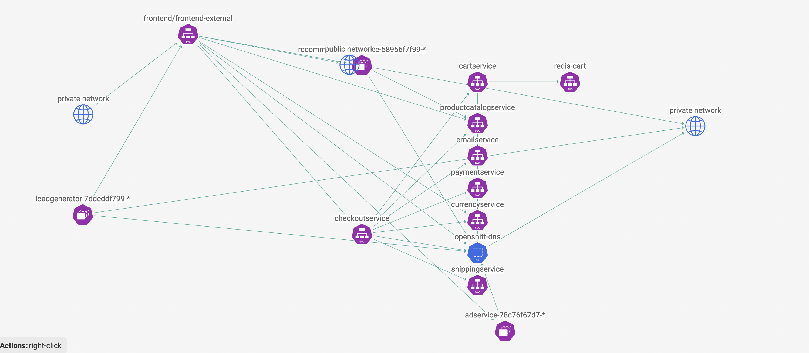

# Observability: Dynamic packet capture

**Goal:** Configure packet capture for specific pods and review captured payload. 

Calico enterprise/cloud provide enhanced packet capture feature for DevOps troubleshooting. Packet captures are Kubernetes Custom Resources and thus native Kubernetes RBAC can be used to control which users/groups can run and access Packet Captures; this may be useful if Compliance or Governance policies mandate strict controls on running Packet Captures for specific workloads. This demo is simplified without RBAC but further details can be found [here](https://docs.tigera.io/v3.10/visibility/packetcapture).

# Steps

 1. Login `hipstershop` namespace from service graph. 

  

 2. Choose a mircroservice which you want to run the packet capture job. we will use frontend as example.

  

 3. We will schedule a packet capture job for TCP port 80 and 8080. 

  

 4. You will notice that the pcap job is in `sheduled` mode now. 
   
  

 5. Fetch and review captured payload.

  
   
 4. Stop packet capture
  
  

## *[Bonus]* Calicocloud provide different RBAC role for packet capture resource. 

 > Calicocloud provide pre-defined role in `manage team - user` which `viwer` doesn't have permissions to `get/list` Packet Capture resource. 

 1. Add one of your team members in this calicocloud management plane. 

  

 2. Confirm they accept your invite. 
  
  

 3. Use their email address to login calicocloud UI and confirm they cannot fetch or create any packet capture jobs.
  
  

[Menu](../README.md)