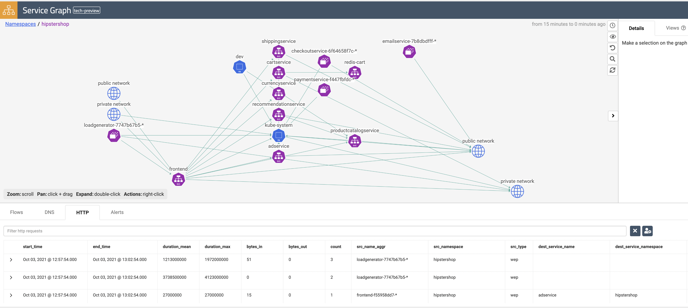

# # Observability: L7 Visibility 

**Goal:** Enable L7/HTTP flow logs in hipstershop with Calico cloud.

Calico cloud not only can provide L3 flow logs, but also can provide L7 visibility without service mesh headache. 
For more details refer to [Configure L7 logs](https://docs.tigera.io/v3.11/visibility/elastic/l7/configure) documentaiton.

## Steps

1. Configure Felix for log data collection 

    ```bash
    oc patch felixconfiguration default --type='merge' -p '{"spec":{"policySyncPathPrefix":"/var/run/nodeagent"}}'
    ```

2. Apply application layer resource and ensure that l7-collector and envoy-proxy containers are in Running state. Refer to [Log Collection Spec](https://docs.tigera.io/v3.11/reference/installation/api#operator.tigera.io/v1.ApplicationLayer) with different options. 

   ```bash
   cat > configs/alr7.yaml << EOF
   apiVersion: operator.tigera.io/v1
   kind: ApplicationLayer
   metadata:
     name: tigera-secure
   spec:
     logCollection:
       collectLogs: Enabled
       logIntervalSeconds: 5
       logRequestsPerInterval: -1
   EOF
   ```

   ```bash
   oc create -f configs/alr7.yaml
   ```

3. Confirm the daemonset is running for each node.

   ```bash
   oc project calico-system
   oc get daemonset.apps/l7-log-collector 
   ``` 

4. Select traffic for L7 log collection

   ```bash
   #Annotate the services you wish to collect L7 logs as shown. Use hipstershop as example
   oc project hipstershop
   oc annotate svc --all projectcalico.org/l7-logging=true
   ```
   
5. *[Optional]* restart the pods in `hipstershop` if you want to see l7 logs right away.    

   ```bash
   oc delete pods --all
   ``` 

  Now view the L7 logs in Kibana by selecting the tigera_secure_ee_l7 index pattern. You should also see the relevant HTTP log from service graph.    

   
   

[Next -> Dynamic packet capture](../modules/dynamic-packet-capture.md) 

[Menu](../README.md)

