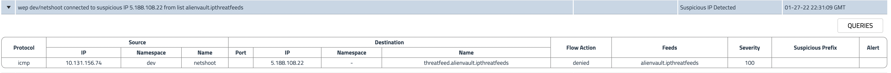

# North-South Controls: Global Threadfeed

**Goal:** Configure egress access control for outside threadfeed policy so workloads within cluster are not allow to external networkset

## Steps

1. Protect workloads with GlobalThreatfeed from known bad actors.

    Calicocloud offers [Global threat feed](https://docs.tigera.io/reference/resources/globalthreatfeed) resource to prevent known bad actors from accessing Kubernetes pods.

    ```bash
    oc get globalthreatfeeds
    ```

    >Output is 
    ```bash
    NAME                           CREATED AT
    alienvault.domainthreatfeeds   2021-09-28T15:01:33Z
    alienvault.ipthreatfeeds       2021-09-28T15:01:33Z
    ```

    You can get these domain/ip list from yaml file, the url would be:

    ```bash
    oc get globalthreatfeeds alienvault.domainthreatfeeds -ojson | jq -r '.spec.pull.http.url'

    oc get globalthreatfeeds alienvault.ipthreatfeeds -ojson | jq -r '.spec.pull.http.url'
    ```

    >Output is 
    ```bash
    https://installer.calicocloud.io/feeds/v1/domains

    https://installer.calicocloud.io/feeds/v1/ips
    ```


    ```bash
    # deploy feodo and snort threatfeeds
    oc apply -f demo/threatfeeds/feodo-tracker.yaml
    oc apply -f demo/threatfeeds/feodo-block-policy.yaml

    # Confirm and check the tracker threatfeed
    oc get globalthreatfeeds 

    ```

    ```bash
    NAME                           CREATED AT
    alienvault.domainthreatfeeds   2021-09-28T15:01:33Z
    alienvault.c       2021-09-28T15:01:33Z
    feodo-tracker                  2021-09-28T17:32:13Z
    ```
    
2. Generate alerts by accessing the IP from `feodo-tracker` list. 

    ```bash
    # confirm you are in `dev` project
    oc status
    ```

    ```bash
    # try to ping any of the IPs in from the feodo tracker list.
    FIP=$(kubectl get globalnetworkset threatfeed.feodo-tracker -ojson | jq -r '.spec.nets[0]' | sed -e 's/^"//' -e 's/"$//' -e 's/\/32//')
    oc exec -t netshoot -- sh -c "ping -c1 $FIP"
    ```

3. Generate alerts by accessing the IP from `alienvault.ipthreatfeeds` list. 

    ```bash
    # try to ping any of the IPs in from the ipthreatfeeds list.
    AIP=$(kubectl get globalnetworkset threatfeed.alienvault.ipthreatfeeds -ojson | jq -r '.spec.nets[0]' | sed -e 's/^"//' -e 's/"$//' -e 's/\/32//')
    oc exec -t netshoot -- sh -c "ping -c1 $AIP"
    ```


4. Add more threatfeeds into networkset and prevent your cluster from them.

    ```bash
    # deploy embargo and other threatfeeds
    oc apply -f demo/threatfeeds/embargo.networkset.yaml
    oc apply -f demo/threatfeeds/security.embargo-countries.yaml
    
    ```
    

5. . Confirm you are able to see the aler in alert list. 
   
     
     
        

[Next -> Manager UI](../modules/manager-ui.md)

[Menu](../README.md)