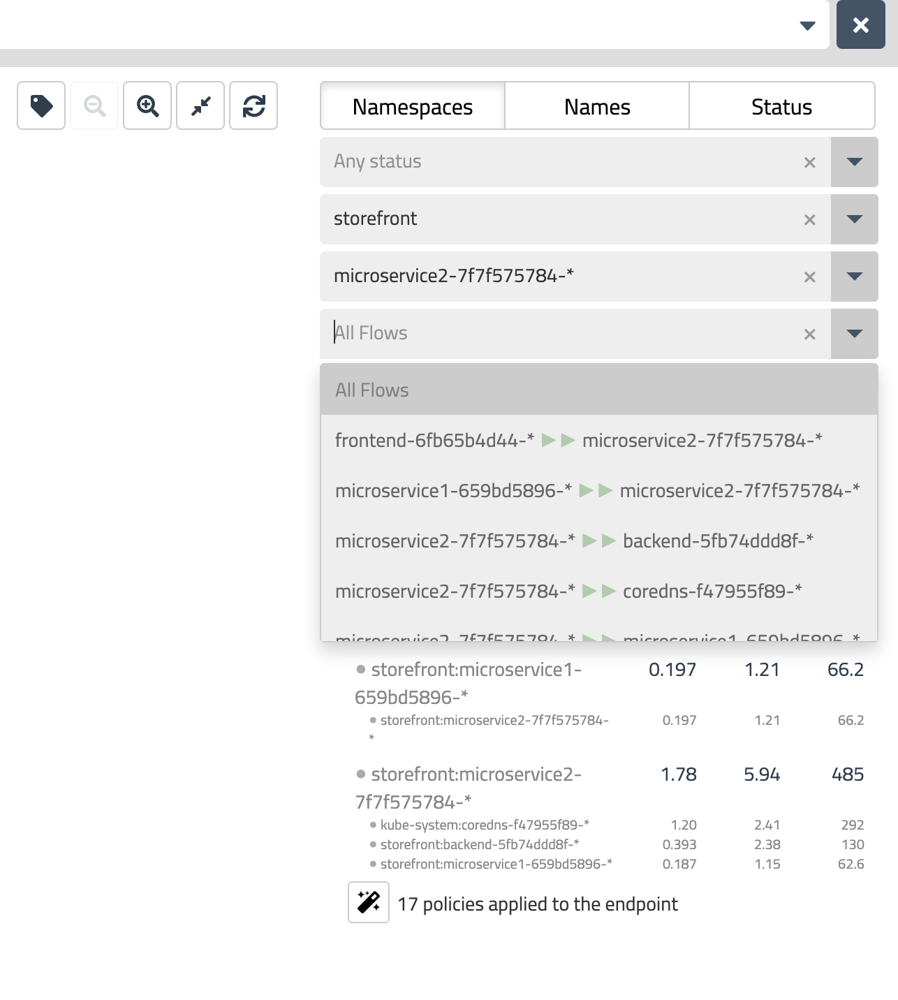
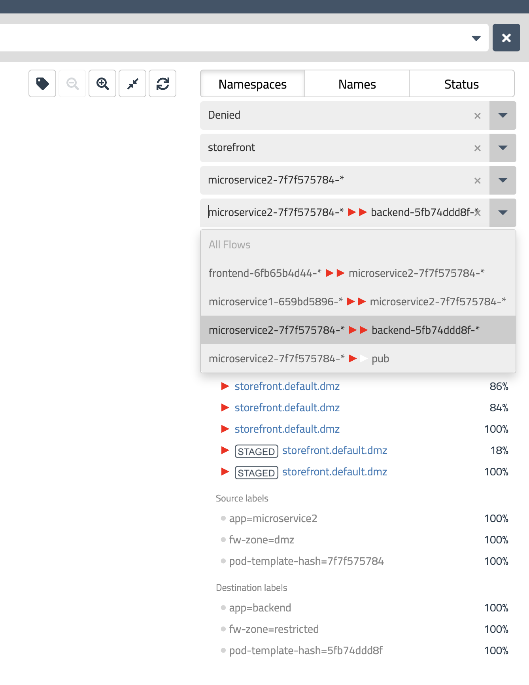

# East-West controls: Pod Microsegmentation

**Goal:** Configure a zone-based architecture for our storefront application, and understand how to troubleshoot with flow visualization.

## Steps

1. Create zone-based policy for storefront application.

    a. Check each mircoservice have proper zone-based label.
    ```bash
    oc project storefront
    oc get pods --show-labels 
    ```

    b. Apply the zone-based policy.
    ```bash    
    oc apply -f demo/app-control/FirewallZonesPolicies.yaml
    ```

2. Confirm the connection from microservice2 to backend are been allowed from flow visualization.

   

3. Change the lable of pod mircoservice2 and see the deny traffic in flow visualization.

    ```bash

    #remove the label 
    oc label pod $(kubectl -n storefront get po -l app=microservice2 -ojsonpath='{.items[0].metadata.name}') fw-zone-

    #add the label as dmz zone
    oc label pod $(kubectl -n storefront get po -l app=microservice2 -ojsonpath='{.items[0].metadata.name}')  fw-zone=dmz
    ```

4. Confirm the connection from microservice2 to backend are been denied.

   

5. Reverse the lable of pod mircoservice2 with overwrite.

    ```bash
    oc label pod $(kubectl -n storefront get po -l app=microservice2 -ojsonpath='{.items[0].metadata.name}') fw-zone=trusted --overwrite
    ```

[Next -> DNS egress control](../modules/dns-egress-controls.md)

[Menu](../README.md)